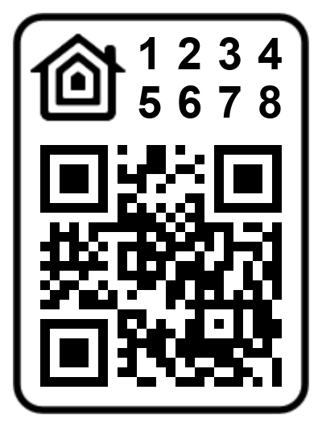

# esp-homekit
Apple HomeKit accessory server library for
[ESP-OPEN-RTOS](https://github.com/SuperHouse/esp-open-rtos).

See [esp-homekit-demo](https://github.com/maximkulkin/esp-homekit-demo) for examples.

## QR code pairing

You can use a QR code to pair with accessories. To enable that feature, you need to
configure accessory to use static password and set some setup ID:

```c
homekit_server_config_t config = {
    .accessories = accessories,
    .password = "123-45-678",
    .setupId="1QJ8",
};
```

The last piece of information you need is accessory category code. You can find it in
mDNS announcement in accessory logs
```
mDNS announcement: Name=Sample LED-1692md=MyLEDpv=1.0id=16:92:CE:D4:EE:7Ac#=1s#=1ff=0sf=1ci=5 Port=5556 TTL=4500
```
(notice "**ci=5**" <- this is accessory category code)

Or just find value of category enum you set in main accessory:
```c
  HOMEKIT_ACCESSORY(.id=1, .category=homekit_accessory_category_lightbulb, .services=(homekit_service_t*[]){
```
(notice "**homekit_accessory_category_lightbulb**" <- this is accessory category code)

Then you need to generate QR code using supplied script:
```
tools/gen_qrcode 5 123-45-678 1QJ8 qrcode.png
```


