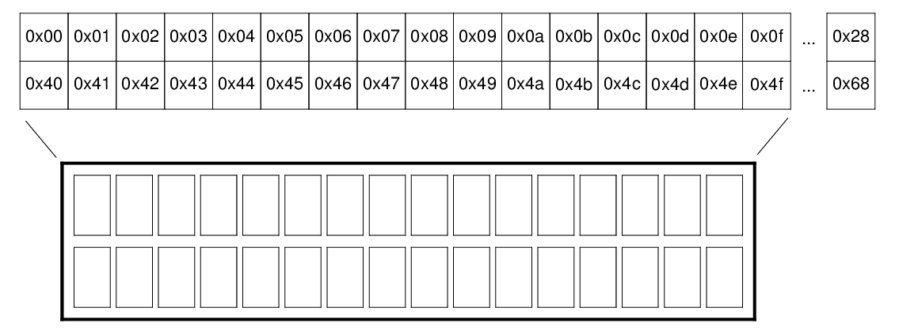
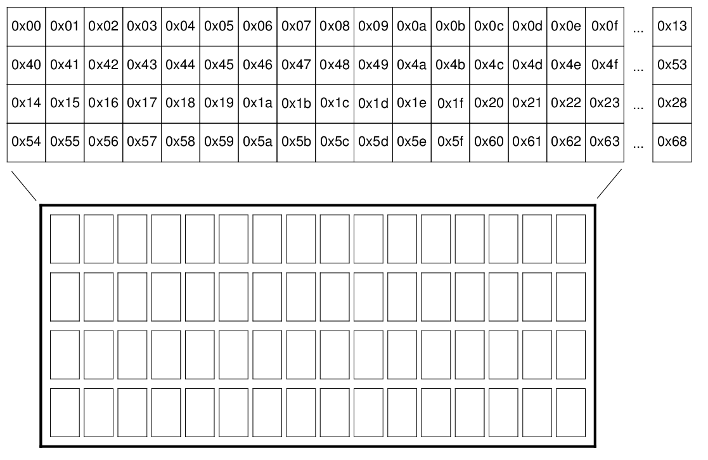

# HD44780 LCD display driver

## Connection type

Driver supports GPIO connections to module and I2C GPIO expanders as well.
Define `HD44780_I2C = 0` in application makefile for direct GPIO connection.

See `examples/i2c_lcd_test` and `examples/hd44780_test` .

## Display types

### 8x1

#### Memory layout


#### Example

```C
hd44780_t lcd = {
    .addr = ADDR,
    .font = HD44780_FONT_5X8,
    .lines = 1,
    .pins = {
        .rs = 0,
        .e  = 2,
        .d4 = 4,
        .d5 = 5,
        .d6 = 6,
        .d7 = 7,
        .bl = 3
    },
    .backlight = true
};
```

### 16x1

#### Memory layout


#### Example

```C
hd44780_t lcd = {
    .addr = ADDR,
    .font = HD44780_FONT_5X8,
    .lines = 2,
    .pins = {
        .rs = 0,
        .e  = 2,
        .d4 = 4,
        .d5 = 5,
        .d6 = 6,
        .d7 = 7,
        .bl = 3
    },
    .backlight = true
};
hd44780_init(&lcd);
hd44780_gotoxy(&lcd, 0, 0);
hd44780_puts(&lcd, "Hello wo");
hd44780_gotoxy(&lcd, 0, 1);
hd44780_puts(&lcd, "rld!");
```

### 16x2, 20x2

#### Memory layout



#### Example

```C
hd44780_t lcd = {
    .addr = ADDR,
    .font = HD44780_FONT_5X8,
    .lines = 2,
    .pins = {
        .rs = 0,
        .e  = 2,
        .d4 = 4,
        .d5 = 5,
        .d6 = 6,
        .d7 = 7,
        .bl = 3
    },
    .backlight = true
};
```

### 16x4, 20x4

#### Memory layout



#### Example

```C
hd44780_t lcd = {
    .addr = ADDR,
    .font = HD44780_FONT_5X8,
    .lines = 4,
    .pins = {
        .rs = 0,
        .e  = 2,
        .d4 = 4,
        .d5 = 5,
        .d6 = 6,
        .d7 = 7,
        .bl = 3
    },
    .backlight = true
};
```
